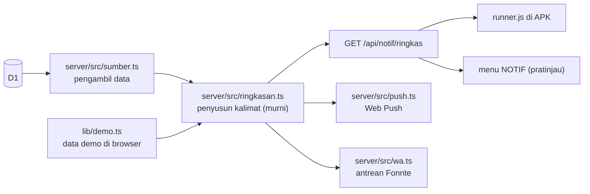
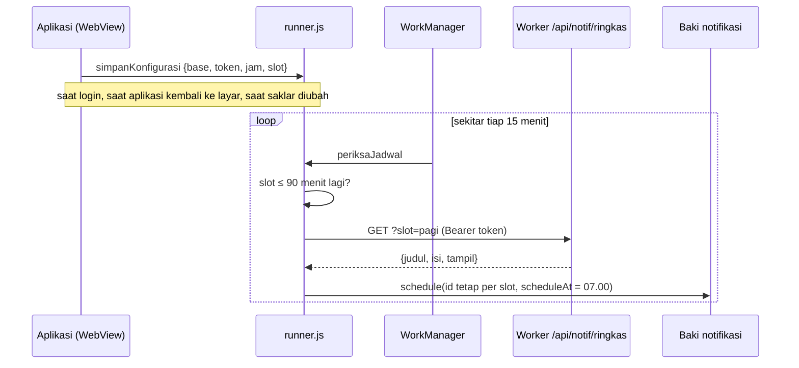
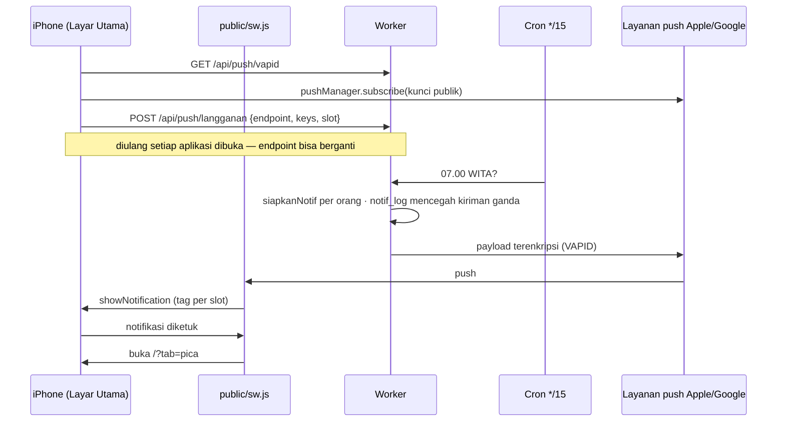
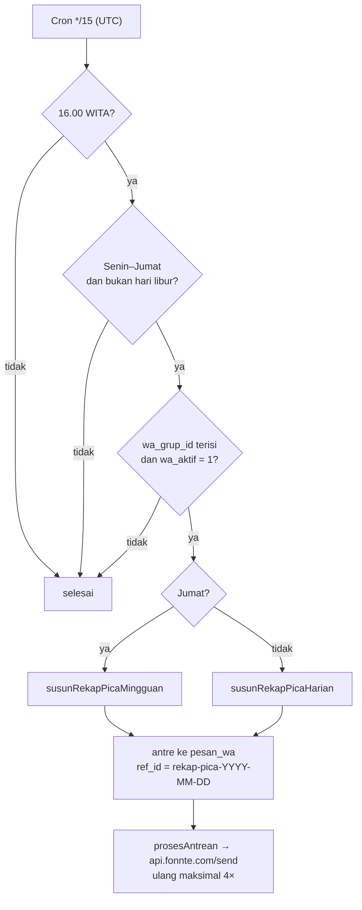

# Alur notifikasi POKEMONKEY

Dua jenis kabar keluar dari aplikasi:

| Jam (WITA) | Isi | Tujuan | Yang mengirim |
|---|---|---|---|
| **07.00** | PICA milikmu yang masih **Open** (Admin/Supervisor juga mendapat angka tim) | Layar HP | APK: Background Runner · iPhone/browser: cron Worker (Web Push) |
| **12.00** | Pengumuman yang belum dibaca (14 hari terakhir) | Layar HP | sama |
| **17.00** | XP dari laporan hari ini, atau pengingat melapor bila belum ada | Layar HP | sama |
| **16.00** Senin–Kamis | Rekap harian progres PICA | Grup WhatsApp | cron Worker → Fonnte |
| **16.00** Jumat | Rekap mingguan PICA | Grup WhatsApp | cron Worker → Fonnte |

Jam notifikasi HP diatur di tabel `pengaturan` (`jam_notif_pagi`, `jam_notif_siang`, `jam_notif_sore`), jam rekap di `jam_rekap_sore`. Setiap orang bisa mematikan slot tertentu di menu **NOTIF** per perangkat.

---

## 1. Satu sumber isi

Kalimat notifikasi dan rekap disusun di satu tempat, sehingga pratinjau di aplikasi sama persis dengan yang terkirim.



- `ringkasan.ts` tidak menyentuh database, jaringan, atau binding Worker.
- `sumber.ts` adalah **satu-satunya** berkas yang mengenal nama tabel. Saat skema database baru selesai, cukup berkas ini yang disesuaikan (lihat [Kontrak data](#5-kontrak-data)).

---

## 2. APK Android — Background Runner

Pola yang sama dengan Smart Nursery, tanpa Firebase. WebView berhenti saat aplikasi ditutup, jadi penjadwalnya berjalan di `runner/index.ts`. Berkas itu dibundel terpisah menjadi `dist/runner.js` dan dibangunkan WorkManager sekitar tiap 15 menit.



Aturan setiap kali runner bangun, untuk tiap slot yang menyala:

| Keadaan | Tindakan |
|---|---|
| Slot masih lebih dari 90 menit lagi | Lewati |
| Slot ≤ 90 menit lagi | Ambil isi terbaru, jadwalkan tepat di jam slot. Bangun berikutnya menjadwal ulang dengan **id yang sama** (4101/4102/4103), jadi yang muncul adalah isi paling baru. |
| Slot sudah lewat < 3 jam, belum pernah terjadwal (HP tertidur) | Tampilkan sekarang sebagai susulan |
| Server menjawab `tampil: false` | Lewati; dianggap selesai bila jamnya tinggal ≤ 15 menit |
| Slot lewat lebih dari 3 jam | Tandai selesai untuk hari ini |

Catatan di CapacitorKV (label `id.ebl.pokemonkey.notifikasi`): `pokemonkey.konfigurasi`, `pokemonkey.jadwal` (status slot per tanggal), `pokemonkey.terakhirPeriksa`.

### Memasang

Butuh Node.js 22+, Android Studio, dan JDK 21 (syarat Capacitor 8).

```bash
npm install
```

```bash
npm run android:tambah
```

Setelah folder `android/` terbentuk, sunting `android/app/src/main/AndroidManifest.xml`:

1. Tambahkan `xmlns:tools="http://schemas.android.com/tools"` pada tag `<manifest>`.
2. Di dalam `<activity android:name=".MainActivity">`, tambahkan penyaring ketukan notifikasi. Tanpa ini notifikasinya muncul, tetapi tidak bisa diketuk:

```xml
<intent-filter>
    <action android:name=".NOTIFICATION_CLICKED" />
    <category android:name="android.intent.category.DEFAULT" />
</intent-filter>
```

3. Sebelum `</manifest>`, tambahkan izin notifikasi dan buang izin bawaan plugin yang tidak dipakai (lokasi dan alarm presisi):

```xml
<uses-permission android:name="android.permission.POST_NOTIFICATIONS" />
<uses-permission android:name="android.permission.ACCESS_COARSE_LOCATION" tools:node="remove" />
<uses-permission android:name="android.permission.ACCESS_FINE_LOCATION" tools:node="remove" />
<uses-permission android:name="android.permission.ACCESS_BACKGROUND_LOCATION" tools:node="remove" />
<uses-permission android:name="android.permission.SCHEDULE_EXACT_ALARM" tools:node="remove" />
```

Lalu bangun dan buka di Android Studio:

```bash
npm run android:sync
```

```bash
npm run android:buka
```

### Menguji di HP

1. Login, buka **MENU → NOTIF**, ketuk **Izinkan notifikasi**.
2. **Kirim contoh**: notifikasi harus muncul dalam beberapa detik.
3. **Periksa sekarang**: kolom *Terakhir memeriksa* di Diagnosa harus berubah.
4. Pantau log runner dari komputer:

```bash
adb logcat | findstr /i "backgroundrunner pokemonkey"
```

---

## 3. iPhone & browser — Web Push

iPhone tidak menjalankan tugas latar untuk aplikasi web, jadi server yang mengirim. Syaratnya: aplikasi **dipasang ke Layar Utama** (iOS 16.4+) dan dibuka lewat **HTTPS** (alamat `workers.dev` sudah cukup; alamat `http://192.168.x.x` tidak bisa).



Langganan yang dijawab 404/410 oleh layanan push langsung dihapus; yang gagal 5 kali berturut-turut juga dihapus.

### Memasang

1. Buat sepasang kunci VAPID:

```bash
npx web-push generate-vapid-keys
```

2. Salin **Public Key** ke `server/wrangler.jsonc` → `vars.VAPID_PUBLIC_KEY`.
3. Simpan **Private Key** sebagai secret (jalankan di folder `server`):

```bash
npx wrangler secret put VAPID_PRIVATE_KEY
```

4. Pasang pustaka push dan terapkan migrasi `0007_memo_internal` + `0008_notifikasi`:

```bash
npm run server:pasang
```

```bash
npm --prefix server run db:awan
```

5. Deploy Worker, lalu di iPhone: buka alamatnya di Safari → **Bagikan** → **Tambah ke Layar Utama** → buka dari ikon → **NOTIF** → **Izinkan notifikasi** → **Kirim contoh**.

> Ikon aplikasi saat ini berupa SVG. iOS memakai tangkapan layar sebagai ikon Layar Utama sampai `public/apple-touch-icon.png` (180×180) ditambahkan.

---

## 4. Rekap PICA ke grup WhatsApp — Fonnte



- **Harian:** angka Terbuka · Open · Telat · Selesai hari ini, lalu *Bergerak hari ini* (maks. 5, dari catatan perkembangan dan perubahan status), *Masih Open* (maks. 5, urut tenggat), dan *Lewat tenggat per PIC*.
- **Jumat:** PICA baru dan ditutup minggu ini, jumlah per bidang, dan PIC yang telat.
- `ref_id` per tanggal + indeks unik `pesan_wa` = satu rekap per hari, walau cron menyentuh slotnya dua kali.
- Rekap hanya diantre saat `wa_aktif = 1`, supaya tidak ada tumpukan rekap lama yang terkirim beruntun ketika saklar dinyalakan.
- Pengingat WA pribadi per PIC (tangga H-3 … H+3) **mati bawaan** (`wa_pengingat_pribadi = 0`); pengingat pribadi kini lewat notifikasi HP pukul 07.00. Satu pesan grup per hari kerja juga mengurangi risiko nomor diblokir.

### Memasang

1. Simpan token perangkat Fonnte sebagai secret (di folder `server`):

```bash
npx wrangler secret put FONNTE_TOKEN
```

2. Di aplikasi (akun Admin): **PICA → ⚙ Atur → Rekap PICA ke grup WhatsApp**
   - isi **ID grup** (berakhiran `@g.us`, dapat dilihat di dasbor Fonnte),
   - centang **Pengiriman WhatsApp aktif**, ketuk **Simpan pengaturan WhatsApp**,
   - ketuk **Pratinjau**, lalu **Kirim sekarang** untuk uji pertama.

---

## 5. Kontrak data

Alur di atas hanya membaca kolom berikut, semuanya lewat `server/src/sumber.ts`. Selama skema baru menyediakan datanya (dengan nama apa pun), hanya berkas itu yang perlu diubah.

| Alur | Tabel & kolom yang dibaca |
|---|---|
| Notif pagi | `pica(id, judul, status, pic_id, due_date, dihapus)`, `tim(id, peran)` |
| Notif siang | `pengumuman(id, judul, penting, dibuat_pada)`, `pengumuman_baca(pengumuman_id, user_id)` |
| Notif sore | `laporan(user_id, xp, dibuat_pada)`, `profil_game(user_id, xp, level, stamina)` |
| Rekap grup | `pica` (+ `bidang`, `dibuat_pada`, `ditutup_pada`), `pica_update(pica_id, catatan, oleh, pada)`, `pica_riwayat(pica_id, kolom, nilai_lama, nilai_baru, oleh, pada)`, `tim(id, nama)`, `libur(tanggal, jenis)`, `pengaturan(wa_grup_id, wa_aktif, jam_rekap_sore)` |
| Kirim push | `push_langganan(user_id, endpoint, p256dh, auth, slot, gagal_berturut)`, `notif_log(user_id, tanggal, slot, kanal)` |

Semua cap waktu disimpan UTC; `sumber.ts` mengubahnya ke tanggal WITA (UTC+8).

---

## 6. Menguji tanpa HP

**Mode demo (tanpa server):** menu **NOTIF** menampilkan pratinjau ketiga slot dari data demo, dan **PICA → Atur → Pratinjau** menampilkan teks rekap grup.

**Server lokal:** jalankan `npm run server`, login untuk mendapatkan token, lalu:

```bash
curl "http://localhost:8787/api/notif/ringkas?slot=pagi" -H "Authorization: Bearer TOKEN_ANDA"
```

```bash
curl -X POST "http://localhost:8787/api/notify/rekap-pica?dryRun=1&jenis=harian" -H "Authorization: Bearer TOKEN_ANDA"
```

---

## 7. Batasan yang perlu diketahui

- **Android tidak presisi ke menit.** WorkManager dan mode Doze bisa menggeser pengingat beberapa menit. Xiaomi, Oppo, vivo, dan Samsung (penghemat baterai) bisa mematikan tugas latar; aplikasi perlu dikecualikan dari penghemat baterai.
- **Saklar yang dimatikan menjelang jamnya** (≤ 90 menit sebelum slot) baru berlaku keesokan harinya, karena notifikasi yang sudah dijadwalkan runner tidak bisa dibatalkan.
- **iPhone hanya lewat Layar Utama.** Safari biasa tidak menerima Web Push. Langganan bisa berganti; aplikasi memperbaruinya setiap kali dibuka.
- **Fonnte memakai jalur WhatsApp tidak resmi.** Karena itu kiriman dibatasi satu rekap per hari kerja, dan hari libur dilewati.
