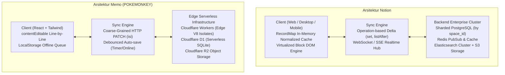
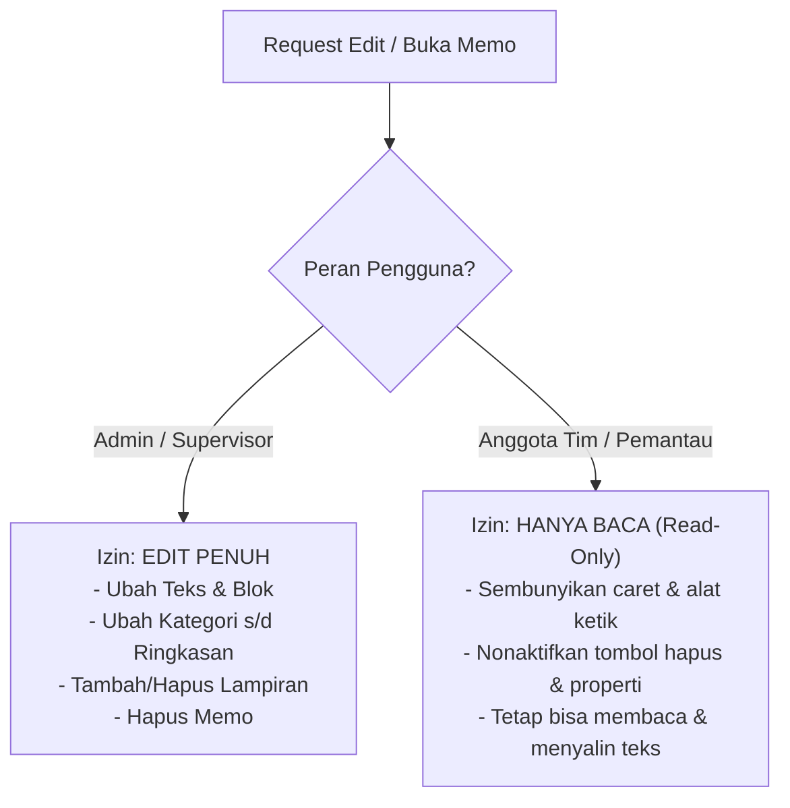
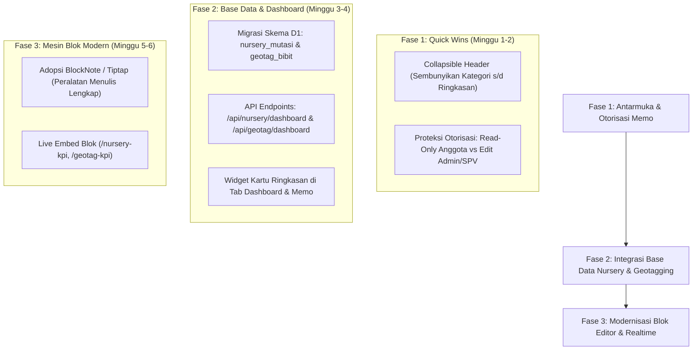

# Master Analisis Arsitektur, Peralatan Menulis & Rancangan Pengembangan Modul Memo (POKEMONKEY)

> **Catatan Kepatuhan:** Seluruh proses analisis dan perancangan ini bersifat *read-only*. Tidak ada berkas kode sumber atau konfigurasi di dalam repositori proyek yang diubah.

---

## 1. Latar Belakang & Konteks Operasional

### 1.1 Konteks Asal-Usul Modul Memo
Aplikasi **POKEMONKEY** dibangun sebagai sistem operasional lapangan terpadu yang melayani pengelolaan rehabilitasi Daerah Aliran Sungai (DAS), penanaman/revegetasi hutan, pemantauan titik panas (*hotspot/karhutla*), roster kerja, pelacakan tindakan korektif (PICA), hingga administrasi operasional harian.

Di tengah aktivitas operasional tersebut, modul **Memo** awalnya lahir sebagai solusi pencatatan praktis untuk:
1. **Pencatatan Cepat di Lapangan:** Menulis catatan teknis, instruksi harian, dan notulensi rapat (*Minutes of Meeting*) di area dengan kondisi sinyal seluler yang sering kali tidak stabil.
2. **Koneksi Otomatis ke Ekosistem Operasional:** Mengaitkan ceklis bertenggat (`@YYYY-MM-DD`) langsung ke kalender `jadwal` kerja tim, menautkan memo ke tiket `pica_id`, serta mendukung ekspor otomatis ke format Excel/Word resmi perusahaan.
3. **Efisiensi Infrastruktur:** Dibangun di atas fondasi serverless modern (*Cloudflare Workers + D1 SQLite + R2 Storage*) demi menekan biaya operasional server mendekati nol, dengan latensi *cold start* minimal di perangkat mobile/web.

### 1.2 Mengapa Notion Menjadi Tolok Ukur (Benchmark)?
Seiring bertambahnya kompleksitas dokumentasi operasional, kebutuhan pengguna berkembang dari sekadar catatan teks sederhana menjadi **ruang kerja pengetahuan terpadu (*collaborative knowledge base*)**. **Notion** menjadi acuan industri utama karena menawarkan tiga keunggulan revolusioner:
- **Modularitas Blok Bebas Hambatan:** Setiap paragraf, gambar, atau daftar tugas dapat digeser, disarang, diubah formatnya, dan ditata berdampingan secara fleksibel.
- **Peralatan Menulis yang Sangat Ergonomis (*Writing Experience*):** Pengguna dapat mengetik secara ekspresif tanpa meninggalkan papan ketik berkat menu garis miring (`/`), *markdown shortcuts*, serta bilah format seleksi yang kaya.
- **Penyatuan Dokumen dan Database:** Dokumen naratif dan tabel data relasional hidup berdampingan dalam satu ruang kerja yang sama.

### 1.3 Batas Teknis (*Technical Ceiling*) yang Dihadapi Memo Saat Ini
Untuk mengejar pengalaman menulis ala Notion, modul Memo saat ini telah mengimplementasikan lapisan editor blok visual di atas dokumen (`EditorMemo.tsx` dan `lib/memo-dom.ts`). Namun, arsitektur dasar Memo saat ini bertumpu pada premis:
> **"Satu dokumen adalah satu string teks panjang, dan satu blok adalah satu baris teks Markdown."**

Premis ini menciptakan batas teknis yang kaku:
1. **Ketiadaan ID Blok Permanen:** Blok tidak dapat diberi tautan langsung (*permalink*), tidak dapat dikomentari secara spesifik, dan riwayat revisi tidak dapat dilacak per baris.
2. **Kekakuan Format Multi-baris:** Pengguna tidak dapat menekan `Shift + Enter` untuk membuat paragraf multi-baris di dalam satu blok tanpa memecahnya menjadi blok baru.
3. **Risiko Kehilangan Data pada Konkurensi:** Karena penyimpanan mengirimkan seluruh string dokumen (`HTTP PATCH`), dua pengguna yang mengedit memo tim yang sama secara bersamaan akan saling menimpa data (*destructive overwrite*).
4. **Keterbatasan Peralatan Format Menulis:** Belum tersedianya tabel sebaris (*simple table*), blok kode, rumus matematika, palet warna/stabilo, dan tata letak multi-kolom.

---

## 2. Peta Komparasi Arsitektur Menyeluruh



| Dimensi Arsitektur | Notion | Modul Memo (POKEMONKEY) |
| :--- | :--- | :--- |
| **Model Data Dasar** | **Tree of Blocks (Graph)**. Setiap elemen adalah objek dengan UUID permanen. | **Monolithic Text String**. Satu string teks (`isi`) di kolom SQLite. |
| **Representasi Blok** | Objek relasional dengan `parent_id`, `content: [id1, id2]`, dan `properties`. | Baris teks dengan konvensi Markdown (`#`, `- [ ]`, `>>`) dan indentasi 2-spasi. |
| **Mesin Database** | **Collections Engine**. Relasional dinamis (Relation, Rollup, Formula 2.0). | **Fixed Table Schema + JSON Props**. Tabel `memo` tetap, kolom kustom di `props` (JSON). |
| **Sinkronisasi & Konkurensi** | **Operation-based Transactions** via WebSocket. Resolusi konflik tingkat field (LWW). | **Full-Payload HTTP PATCH**. Seluruh teks dikirim ulang; risiko penimpaan destruktif. |
| **Rendering Client** | **Virtualized Custom DOM Engine**. Hanya me-render blok di dalam viewport layar. | **Standard React DOM**. Seluruh baris dirender serentak tanpa virtualisasi. |
| **Infrastruktur Backend** | Sharded PostgreSQL, Redis Cluster, Kafka/SQS, Elasticsearch, AWS S3. | Cloudflare Workers (Edge Compute), Cloudflare D1 (SQLite), Cloudflare R2. |

---

## 3. Bedah Khusus: Peralatan Menulis (*Writing Tools*)

```
+-----------------------------------------------------------------------------------+
| PERALATAN MENULIS                | NOTION                   | MEMO (POKEMONKEY)   |
+-----------------------------------------------------------------------------------+
| 1. Bilah Format Mengambang       | Lengkap (Warna, Rumus,   | Terbatas (B, I, S,  |
|    (Selection Bubble Toolbar)    | Underline, Komentar, AI) | Code, Link)         |
|                                  |                          |                     |
| 2. Menu Garis Miring (Slash `/`) | 40+ Perintah (Blok, DB,  | 15 Perintah Dasar   |
|                                  | Kolom, Media, Warna)     | (Teks, List, Media) |
|                                  |                          |                     |
| 3. Pegangan Blok (Handle `⋮⋮`)   | Drag Horisontal (Kolom), | Drag Vertikal saja, |
|                                  | Warna, Turn into Page    | Ubah, Gandakan      |
|                                  |                          |                     |
| 4. Pintasan Ketik (Shortcuts)    | Markdown kaya + ``` +    | Markdown dasar      |
|                                  | $$ + :emoji: + Shift+Ret | (Tanpa soft-break)  |
|                                  |                          |                     |
| 5. Tabel Sebaris (Simple Table)  | Ada (Baris/Kolom bebas)  | Tidak Ada           |
|                                  |                          |                     |
| 6. Penyesuaian Gambar & Media    | Resize handle, Caption,  | Lebar otomatis,     |
|                                  | Alignment kiri/tengah    | Statis              |
|                                  |                          |                     |
| 7. Palet Warna & Highlight       | 10 Warna Teks & Latar    | Tidak Ada           |
|                                  |                          |                     |
| 8. Blok Kode & Rumus Matematika  | Syntax Highlighter,      | Tidak Ada           |
|                                  | KaTeX LaTeX sebaris/blok |                     |
+-----------------------------------------------------------------------------------+
```

### A. Bilah Format Mengambang (*Selection Bubble Toolbar*)
- **Kondisi Memo Saat Ini (`EditorMemo.tsx:1454`):**
  - Hanya memiliki 5 tombol pintasan: **Tebal** (`Ctrl+B`), **Miring** (`Ctrl+I`), **Coret** (`Ctrl+Shift+S`), **Kode** (`Ctrl+E`), dan **Tautan** (`Ctrl+K`).
- **Kekurangan Dibandingkan Notion:**
  - Belum ada **Garis Bawah (*Underline* `Ctrl+U`)**.
  - Belum ada **Palet Warna Teks dan Stabilo (*Highlight Background*)**.
  - Belum ada opsi **Rumus Matematika Sebaris (*Inline KaTeX*)**.
  - Belum ada fitur **Komentar Sebaris (*Inline Comment*)**.
  - Belum ada opsi **Ubah Jadi Blok Lain (*Turn into*)** langsung dari teks terpilih.

### B. Menu Garis Miring (*Slash Commands `/`*)
- **Kondisi Memo Saat Ini (`lib/blok-jenis.ts`):** 15 item dasar.
- **Kekurangan Dibandingkan Notion:**
  - Belum ada perintah `/code` (*syntax highlighting* & tombol salin).
  - Belum ada perintah `/math` (persamaan KaTeX/LaTeX).
  - Belum ada perintah `/table` (tabel dokumen non-database yang fleksibel).
  - Belum ada perintah `/toc` (daftar isi otomatis).
  - Belum ada perintah `/col2` atau `/col3` (pembuat kolom seimbang).
  - Belum ada perintah warna instan (`/merah`, `/stabilo-kuning`).
  - Belum ada perintah `/bookmark` untuk memunculkan pratinjau kartu tautan web.

---

## 4. Rancangan Fitur UX & Kontrol Akses Otorisasi Baru

Berdasarkan kebutuhan penyesuaian antarmuka dan keamanan hak akses, berikut rancangan arsitektur untuk:
1. Menyembunyikan metadata header di awal (Kategori s/d Ringkasan).
2. Menerapkan kontrol akses berjenjang: **Hanya-Baca (*Read-Only*)** bagi anggota biasa dan **Edit Penuh** khusus **Admin & Supervisor (SPV)**.

### 4.1 Rancangan Properti Header yang Dapat Dilipat (*Collapsible Properties*)

Saat ini di [`MemoScreen.tsx`](file:///d:/pokemonkey%20%282%29/components/MemoScreen.tsx), panel metadata (Kategori, Tipe, Status, Tanggal, PICA, Ringkasan, dan Properti Kustom) selalu tampil terbuka di bagian atas memo. Hal ini menghabiskan ruang vertikal di layar smartphone dan mengaburkan fokus penulisan.

```
+-------------------------------------------------------------+
| [Ikon] [Judul Memo: Rencana Penanaman Blok 3 DAS]           |
|                                                             |
| ▶ Tampilkan Rincian Properti (Kategori, Status, Tanggal...)  |  <-- Default: Tertutup (Folded)
| ----------------------------------------------------------- |
| [Mode Tulis Bebas Dimulai di Sini...]                       |
| # Sasaran Kerja                                             |
| - [ ] Persiapan bibit mahoni 2.000 btg                      |
+-------------------------------------------------------------+
```

#### Solusi Arsitektural:
1. **Pola "Hide Properties" ala Notion:**
   - Panel properti dibungkus dalam komponen accordion lipat (`bukaProperti: boolean`).
   - Secara bawaan (*default*), properti **disembunyikan (collapsed)**, hanya menampilkan baris ringkas:  
     `[▶ 4 Properti: Revegetasi · Sedang Berlangsung · 2026-10-05]`.
   - Mengklik baris tersebut akan membuka seluruh editor properti (Kategori, Tipe, Status, Tanggal, Ringkasan, PICA, dan properti kustom).
2. **Penyimpanan Preferensi Tampilan:**
   - Status lipatan disimpan di `localStorage` per pengguna (`pokemonkey_memo_lipat_props`), sehingga pengguna yang menyukai tampilan bersih tidak perlu melipat ulang setiap kali membuka memo.
3. **Pengecualian Status Kosong:**
   - Jika memo baru saja dibuat (belum memiliki kategori/status), panel otomatis terbuka agar penulis ingat melengkapi metadata dasar.

---

### 4.2 Skema Kontrol Otorisasi: Read-Only vs. Admin & SPV

Sistem saat ini mengizinkan setiap penulis mengedit memo miliknya sendiri secara bebas. Untuk tata kelola organisasi lapangan, skema ini disempurnakan menjadi kontrol berjenjang berbasis peran (*Role-Based Access Control*):



#### 1. Penerapan di Lapisan Frontend (`EditorMemo.tsx` & `MemoScreen.tsx`):
- Penentuan status hak akses dihitung secara deklaratif:
  ```typescript
  // Hanya Admin dan Supervisor yang memiliki izin menyunting memo tim
  const bolehEdit = Boolean(
    pengguna.peran === 'admin' || 
    pengguna.peran === 'supervisor' ||
    (memo.lingkup === 'pribadi' && memo.user_id === pengguna.id)
  );
  ```
- **Jika `bolehEdit === false` (Mode Hanya-Baca):**
  - Blok teks diatur `contentEditable={false}` sehingga kursor ketik (*caret*) dan papan ketik tidak muncul.
  - Bilah alat bawah HP (*mobile toolbar*), tombol tambah blok `+`, dan handle drag `⋮⋮` tidak dirender.
  - Form Properti (Kategori, Status, Tanggal, Ringkasan) beralih ke mode teks statis (bukan dropdown/input yang bisa diklik).
  - Tampilkan lencana (*badge*) halus di pojok atas: `[👁️ Hanya Baca]`.

#### 2. Penerapan di Lapisan Backend (`server/src/personal.ts` & `server/src/lihat-memo.ts`):
- Endpoint `PATCH /api/memo/:id` dan `DELETE /api/memo/:id` wajib memverifikasi otorisasi di tingkat kernel serverless:
  ```typescript
  // Di server/src/personal.ts:
  const adalahSpvAtauAdmin = pengguna.peran === 'admin' || pengguna.peran === 'supervisor';

  if (memo.lingkup === 'tim' && !adalahSpvAtauAdmin) {
    return galat('Akses ditolak: Hanya Admin dan Supervisor yang berhak menyunting Memo Tim.', 403);
  }
  ```
- Integritas data terjamin: Sekalipun ada manipulasi request dari client (misal menggunakan cURL/Postman), server D1 Cloudflare akan menolak dengan kode status HTTP 403 Forbidden.

---

## 5. Rancangan Penambahan Base Data Smart Nursery & Geotagging

Mengadopsi arsitektur analitik teruji dari proyek pendamping `"D:\Belajar Koding\AI suara\eracc-terminal"`, modul Memo dan POKEMONKEY dapat diperkaya dengan **Base Data Terintegrasi** untuk persemaian bibit (*Smart Nursery*) dan pemantauan bibit tertanam di lapangan (*Geotagging*).

### 5.1 Ringkasan Pengembang: Data Dashboard Smart Nursery (dari `nursery_analitik.py`)
Dalam `eracc-terminal`, analitik Smart Nursery dihitung secara terpusat di SQL dan menyajikan metrik operasional terpenting:

#### A. KPI Inti (*Summary Cards*):
- **Stok Terkini:** Dihitung dengan rumus matematis ketat: `Stok = Masuk - Keluar - Mati`.
- **Mortalitas (%):** Persentase bibit mati/afkir terhadap total bibit masuk (`mati / masuk * 100`).
- **Aktivitas Hari Ini:** `masuk_hari_ini`, `keluar_hari_ini`, `mati_hari_ini`.
- **Hari Aktif & Rentang Tanggal:** Periode awal dan akhir pencatatan stok.

#### B. Struktur Grafik & Distribusi Dashboard:
1. **Diagram Air Terjun (*Waterfall Stock Flow*):**
   - Menjelaskan asal muasal stok: Batang `Masuk` (+) $\rightarrow$ `Keluar` (-) $\rightarrow$ `Mati` (-) $\rightarrow$ `Stok Kini` (Total).
2. **Sebaran per Jenis Bibit:**
   - Jumlah stok, bibit masuk, dan rasio mortalitas per spesies (Mahoni, Sengon, Ulin, Trembesi, Meranti, dll.).
3. **Analisis Pareto Tujuan Pengiriman (*Distribution Target*):**
   - Menampilkan blok-blok penanaman mana yang paling banyak menyerap bibit (misal Blok DAS Kintap, Blok EBL-01, dll.).
4. **Proyeksi Habis Stok (*Stock Depletion Forecast*):**
   - Estimasi tanggal habis bibit berdasarkan laju pengeluaran rata-rata 30 hari terakhir.

---

### 5.2 Ringkasan Pengembang: Data Dashboard Geotagging (dari `geotag_analitik.py`)
Analitik Geotagging memproses data titik penanaman lapangan secara spasial dan biomassa:

#### A. KPI Inti (*Summary Cards*):
- **Total Bibit Tertanam:** Akumulasi seluruh bibit yang telah diberi titik geotag.
- **Kondisi Kesehatan:**
  - `Sehat` (batang tegak, daun hijau segar)
  - `Merana` (daun menguning, patah, tergenang)
  - `Mati` (kering, busuk)
  - `% Hidup`: `(Sehat + Merana) / Total * 100`
  - `% Sehat`: `Sehat / Total * 100`
- **Integritas Geospasial:**
  - `Berkoordinat`: Jumlah bibit yang memiliki latitudo/longitudo valid.
  - `Berfoto`: Jumlah bibit yang memiliki lampiran foto di Cloudflare R2 (`photo_key`).
- **Morfometri & Pertumbuhan:**
  - Rata-rata tinggi, tinggi minimum, dan tinggi maksimum bibit.

#### B. Estimasi Cadangan Biomassa & Karbon (Model Alometrik):
- Dihitung langsung di atas database dengan fungsi alometrik:
  $$\text{AGB (Above-Ground Biomass)} = f(\text{tinggi})$$
  $$\text{Cadangan Karbon (kg C)} = \text{Biomassa} \times 0.47 \text{ (Fraksi Karbon SNI)}$$
- Menghasilkan metrik: **Total Karbon Tersimpan (kg C)** per blok penanaman.

---

### 5.3 Skema Basis Data Terpadu di Cloudflare D1

Untuk mengintegrasikan base data ini ke POKEMONKEY, berikut rancangan tabel D1 pendukung:

```sql
-- 1. Base Data Smart Nursery: Mutasi dan Stok Bibit
CREATE TABLE IF NOT EXISTS nursery_mutasi (
  id TEXT PRIMARY KEY,               -- 'nur_xxxx'
  tanggal TEXT NOT NULL,             -- 'YYYY-MM-DD'
  jenis_bibit TEXT NOT NULL,         -- 'Mahoni', 'Sengon', dll.
  tipe_mutasi TEXT NOT NULL,         -- 'masuk', 'keluar', 'mati'
  jumlah INTEGER NOT NULL,           -- kuantitas bibit
  blok_tujuan TEXT,                  -- 'Blok 1 DAS', 'Rehab 2026', dll.
  surat_jalan_no TEXT,               -- Nomor referensi surat jalan
  driver TEXT,                       -- Nama sopir/pengantar
  catatan TEXT,
  dibuat_oleh TEXT NOT NULL,
  dibuat_pada TEXT NOT NULL
);

-- 2. Base Data Geotagging Bibit Lapangan
CREATE TABLE IF NOT EXISTS geotag_bibit (
  id TEXT PRIMARY KEY,               -- 'geo_xxxx'
  tanggal_tanam TEXT NOT NULL,       -- 'YYYY-MM-DD'
  blok_id TEXT NOT NULL,             -- Relasi ke SHP Blok DAS
  spesies TEXT NOT NULL,             -- Jenis tanaman
  kesehatan TEXT NOT NULL,           -- 'Sehat', 'Merana', 'Mati'
  tinggi_cm REAL,                    -- Tinggi bibit dalam cm
  lat REAL NOT NULL,                 -- Titik lintang GPS
  lon REAL NOT NULL,                 -- Titik bujur GPS
  foto_r2_key TEXT,                  -- Kunci foto di Cloudflare R2
  surveyor_id TEXT NOT NULL,         -- Anggota tim yang memotret
  dibuat_pada TEXT NOT NULL
);

-- Indeks Kinerja untuk Dashboard Cepat
CREATE INDEX IF NOT EXISTS idx_nursery_tgl_jenis ON nursery_mutasi(tanggal, jenis_bibit);
CREATE INDEX IF NOT EXISTS idx_geotag_blok_kes ON geotag_bibit(blok_id, kesehatan);
```

---

### 5.4 Rancangan Blok Sematan Live Dashboard di Memo (*Interactive Embeds*)

Dengan tersedianya basis data ini, modul Memo dapat dilengkapi dengan **Blok Dashboard Sebaris (*Live Embed Blocks*)**. Penulis (Admin/SPV) cukup mengetik menu garis miring di dokumen:

1. `/nursery-kpi`:
   - Menghasilkan kartu interaktif mini di tengah memo yang menampilkan:
     `[🌱 Stok Nursery: 45.200 btg | Mortalitas: 2.1% | Masuk Hari Ini: +500 btg]`
2. `/geotag-kpi`:
   - Menghasilkan kartu progres tanam:
     `[📍 Realisasi Tanam: 12.450 / 20.000 Titik | Persen Hidup: 94.2% | Estimasi Karbon: 8.4 Ton C]`

Data di dalam memo ini **selalu hidup dan terbarui otomatis (*live query*)**, sehingga laporan bulanan atau notulensi evaluasi lapangan tidak perlu lagi menyalin tabel manual dari spreadsheet.

---

## 6. Peta Jalan Eksekusi Pengembangan Terpadu



Dengan tahapan ini, aplikasi **POKEMONKEY** tidak hanya memiliki modul Memo dengan pengalaman menulis yang ergonomis setara Notion, melainkan juga memiliki keunggulan kompetitif yang jauh lebih tinggi: **integrasi data spasial dan logistik persemaian lapangan yang hidup secara langsung di dalam dokumen**.
