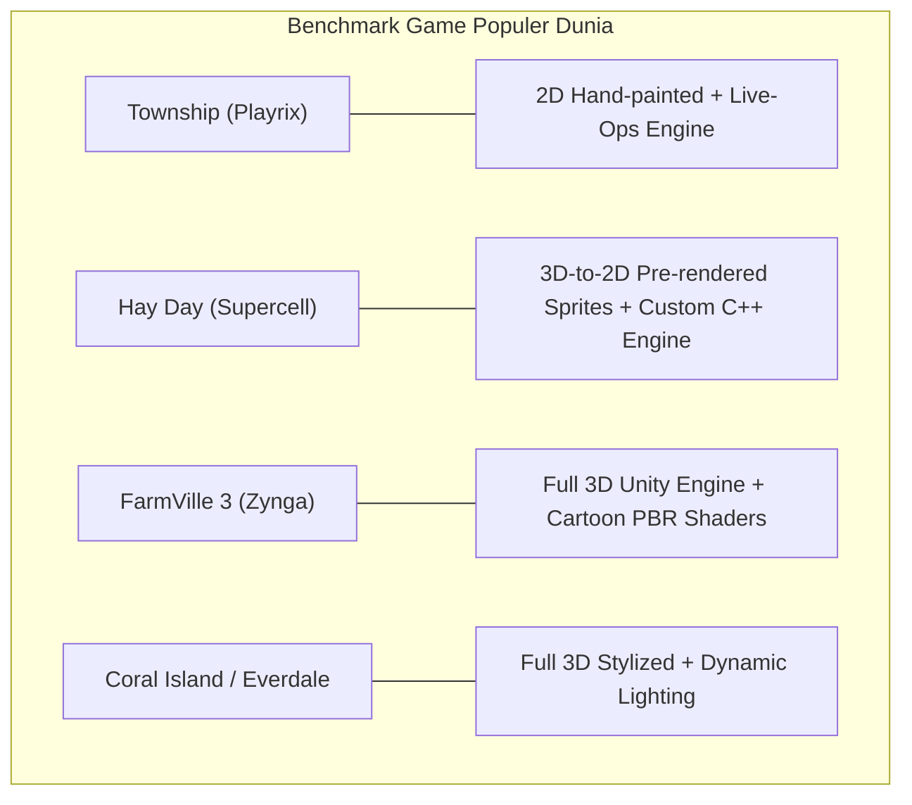
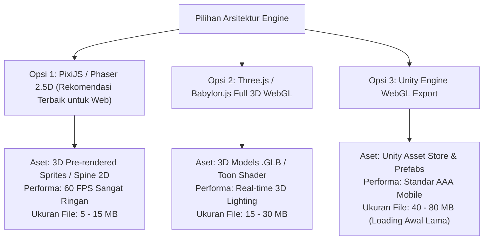
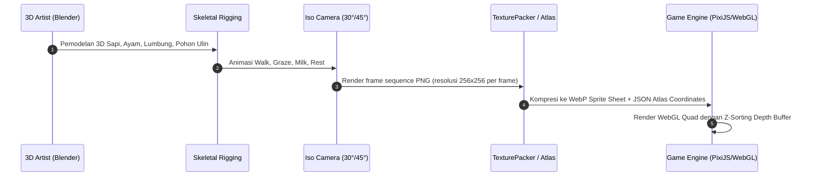
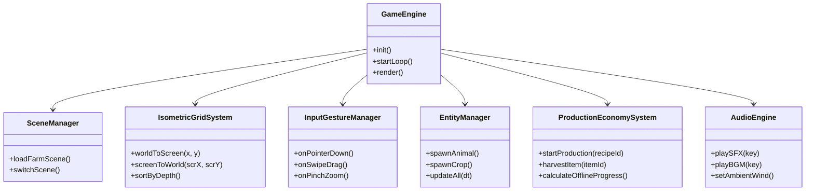
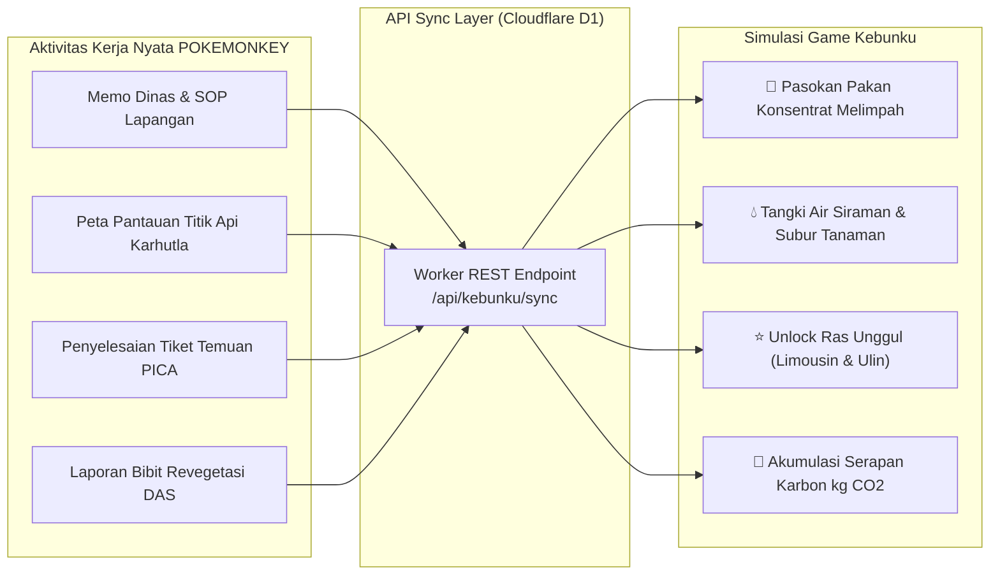
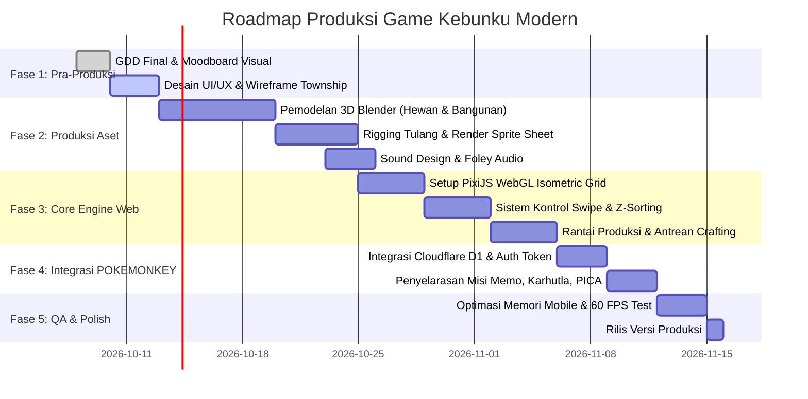
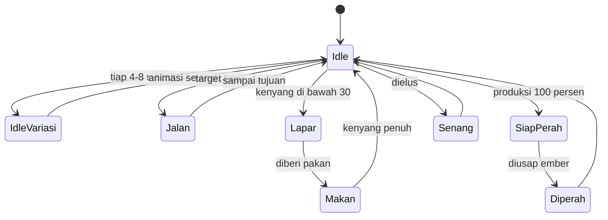
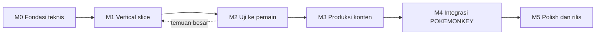

# Blueprint Arsitektur Game Modern: "Kebunku" (Township & Hay Day Professional Standard)

> **Dokumen Desain Game & Arsitektur Teknis (Game Design Document & Technical Architecture)**  
> **Target Standar:** Kualitas visual, game feel, dan animasi setara game mobile komersial kelas dunia (*Township by Playrix, Hay Day by Supercell, FarmVille 3 by Zynga*).  
> **Status:** Perencanaan Arsitektur & Pipeline Produksi (Non-Execution Phase).  
> **Revisi 8 Okt 2026:** Ditambah bagian 8–16: arah visual, standar animasi, VFX, kamera, UI/HUD, anggaran performa, strategi aset untuk tim kecil, roadmap vertical slice, dan checklist kualitas.

---

## 1. Mengapa Prototipe Kode Prosedural Berbeda Jauh dari Game Zaman Sekarang?

Untuk memahami bagaimana game profesional dibangun, kita harus melihat secara jujur perbedaan mendasar antara **kode kanvas prosedural** dengan **pipeline game studio modern**:

```
+---------------------------------------------------------------------------------------------------------------------+
| ASPEK             | PROTOTIPE KANVAS KODE (YANG KITA BUAT SEBELUMNYA) | GAME KOMERSIAL MODERN (TOWNSHIP / HAY DAY)         |
+---------------------------------------------------------------------------------------------------------------------+
| Sumber Visual     | ctx.arc(), ctx.roundRect(), gradasi kode Math     | Aset Digital Painting 2D & Model 3D Pre-Rendered    |
| Tekstur           | Warna flat solid & gradasi linear standar         | Hand-painted PBR texture, Ambient Occlusion, Rim    |
| Animasi           | Rotasi sudut sinusoida Math.sin(time)             | Spine 2D Skeletal Rigging / 3D Skeletal Animation   |
| Kedalaman Ilusi   | Bayangan elips semi-transparan tunggal            | Directional light baking, Normal Maps, Soft Shadows |
| Game Feel / Juice | Floating text & partikel dasar                    | Spine deformation squash/stretch, screen shake, FX  |
| Tim Pembuat       | 1 script AI tanpa file gambar (.png/.webp)        | Tim 20+ orang (Concept Artist, 3D Modeler, Rigger)  |
+---------------------------------------------------------------------------------------------------------------------+
```

### Kesimpulan Kritis:
Dalam industri game profesional, **tidak ada satu pun game seperti Township atau Hay Day yang menggambar hewannya menggunakan perintah garis kanvas (`canvas 2d drawing context`)**.
- **Supercell (Hay Day)**: Membangun seluruh sapi, domba, traktor, dan bangunan dalam **software 3D (Maya/Blender)**, membuat rigging tulang, lalu mengekspornya menjadi **lembaran sprite 2D resolusi tinggi (*3D-to-2D Pre-rendered Sprites*)** yang dipotong tepat pada sudut kamera isometrik ($30^\circ$ elevasi, $45^\circ$ azimut).
- **Playrix (Township)**: Menggunakan seniman ilustrasi (*digital concept artists*) yang melukis setiap sudut bangunan secara manual di Photoshop, lalu menggunakan software **Spine 2D** untuk memecah anggota tubuh hewan menjadi jaring mesh yang dapat ditarik, bernapas, dan melangkah lentur.

---

## 2. Analisis Benchmark Game Sejenis di Industri



### 1. Hay Day (Supercell)
- **Engine:** In-house proprietary C++ cross-platform engine.
- **Pipeline Grafis:** Model 3D dirender mati ke ratusan frame sprite sheet 2D. Hal ini memberikan bobot 3D yang sangat presisi namun ringan dimuat di perangkat ponsel mana pun.
- **Kontrol Signature:** Gestur usap jari (*swipe-to-action*) di mana pemain tidak pernah merasa "mengeklik tombol", melainkan menyapu alat melintasi layar secara taktil.

### 2. Township (Playrix)
- **Engine:** Proprietary multiplatform 2D engine dengan arsitektur data-driven Live-Ops.
- **Visual:** Sangat kaya akan detail kecil (warga kota berjalan di trotoar, mobil melintas, burung camar terbang, asap pabrik mengepul lembut).
- **Struktur Inti:** Pertanian hanyalah rantai pasok paling bawah. Lapisan di atasnya adalah pabrik pengolahan, pengiriman helikopter, pesanan kereta api, dan pembangunan fasilitas kota.

### 3. FarmVille 3 (Zynga) & Everdale
- **Engine:** Unity 3D WebGL / Native Mobile.
- **Visual:** Sepenuhnya model 3D poligon rendah (*low-poly stylized*) dengan shader kartun (*cell-shading*), pencahayaan dinamis matahari, dan bayangan bergerak *real-time*.

---

## 3. Pilihan Arsitektur Teknologi untuk Game "Kebunku"

Untuk menghadirkan game yang benar-benar berkualitas tinggi di web browser (baik sebagai game mandiri maupun disematkan ke POKEMONKEY), ada **3 arsitektur profesional** yang dapat diadopsi:



### Rekomendasi Terpilih: **Opsi 1 (PixiJS 2.5D Sprite-Atlas Engine)**
**Alasan:**
1. **Identik dengan Arsitektur Asli Hay Day & Township**: Menggunakan sprite sheets pre-rendered dari model 3D Blender.
2. **Super Ringan & Instan di Web**: PixiJS menggunakan WebGL untuk merender ribuan sprite pada kecepatan 60 FPS murni tanpa waktu pemuatan (*loading time*) yang berat seperti Unity.
3. **Mudah Diintegrasikan ke React / Vite**: Dapat dijalankan di dalam canvas HTML5 murni tanpa plugin eksternal yang rumit.

---

## 4. Pipeline Produksi Aset (Art & Animation Pipeline)

Inilah alur kerja standar studio game untuk memproduksi aset visual yang setara dengan game masa kini:



### Tahapan Produksi Aset:
1. **Pemodelan 3D (*Stylized 3D Modeling*):**
   - Dibuat di software **Blender 4.x**.
   - Model dibuat bergaya *chunky stylized* (proporsi tubuh bulat, kepala lebih besar, mata ekspresif khas Township).
2. **Tekstur & Shading (*Hand-painted PBR*):**
   - Pewarnaan gradasi lembut dengan *ambient occlusion* yang dipanggang (*baked AO*).
   - Menghasilkan warna cerah, bersih, dan ramah keluarga (*cheerful casual palette*).
3. **Rigging Tulang & Animasi:**
   - **Sapi:** Rig 16 tulang (tulang panggul, 4 kaki dengan IK constraints, leher, kepala, telinga, lonceng, ambing susu).
   - Animasi: `idle_breathe` (60 frame), `walk_cycle` (40 frame), `chew_grass` (60 frame), `produce_milk` (30 frame).
4. **Baking ke Isometrik 2.5D (*Isometric Render Batch*):**
   - Kamera Blender diatur pada sudut isometrik baku:
     - **Elevasi vertikal:** $30^\circ$ (atau true dimetric $35.264^\circ$).
     - **Rotasi horizontal:** $45^\circ$.
   - Render multi-arah: 4 arah hadap (South-East, South-West, North-East, North-West).
5. **Atlas Packing (*TexturePacker*):**
   - Seluruh frame animasi digabungkan ke dalam 1 berkas `cow_spritesheet.webp` dan `cow_spritesheet.json`.
   - Mengurangi *draw call* WebGL dari ratusan menjadi hanya **1 draw call tunggal** per hewan.

---

## 5. Arsitektur Kode & Sistem Engine Game (*Core System Architecture*)

Game modern menggunakan pola arsitektur **Entity-Component-System (ECS)** atau **Modular Manager Pattern**, bukan kode satu file monolitik.



### Modul-Modul Utama:

#### 1. `IsometricGridSystem` (Sistem Koordinat & Kedalaman Ruang)
- Menangani pemetaan koordinat Cartesian $(X, Y)$ ke layar berlian $2:1$.
- **Dynamic Depth Sorting (Z-Sorting):** Menggunakan formula kedalaman terintegrasi untuk mencegah tabrakan visual:
  $$\text{Depth} = (X + Y) \times 1000 + Z_{\text{layer}}$$
- Menangani ubin berundak (*cliff elevation*), jalur air mengalir, dan jembatan penyeberangan.

#### 2. `InputGestureManager` (Sensasi Kontrol Township / Hay Day)
- **State Machine Gesture:** Membedakan antara sapuan layar untuk menggeser kamera (*camera pan*), cubitan dua jari (*pinch zoom*), ketukan tunggal (*object selection*), dan usapan alat berantai (*swipe-to-action*).
- **Sweep Collider Raycaster:** Saat pemain memegang sabit atau ember pakan, sistem membuat jejak collider beradius 30px di sepanjang jalur kursor. Objek apa pun yang bersilangan akan terpicu secara instan dengan efek partikel dan nada audio yang meningkat bertingkat (*pitch-shifted combo audio*).

#### 3. `ProductionEconomySystem` (Sistem Waktu Nyata & Offline Progression)
- Berjalan berdasarkan *tick-rate* matematis.
- **Offline Calculation:** Saat pemain menutup aplikasi selama 4 jam dan membukanya kembali, sistem menghitung durasi waktu yang terlewat:
  $$\Delta t = \text{currentTime} - \text{lastSavedTimestamp}$$
  dan secara deterministik memperbarui pertumbuhan jagung, pengolahan pakan, dan susu sapi yang siap dipanen.

#### 4. `AudioEngine` (Soundscape Imersif Pedesaan)
- Menggunakan Web Audio API / Howler.js dengan *sound layering*:
  - **Lapisan 1 (Ambience):** Suara hembusan angin sepoi-sepoi dan kicau burung hutan Kalimantan yang berputar halus tak berujung.
  - **Lapisan 2 (Foley Hewan):** Suara langkah kaki kuku sapi di tanah, lenguhan sapi alami beresonansi, suara ayam mematuk biji jagung.
  - **Lapisan 3 (UI Juice):** Efek panen "pop-ding-splash" yang ceria dan renyah.

---

## 6. Arsitektur Jembatan Operasional POKEMONKEY (*Real-World Synergy*)

Nilai unik dari game ini adalah keterhubungannya dengan operasional nyata perkebunan, DAS, dan pabrik POKEMONKEY. Game ini bukan sekadar hiburan kosong, melainkan **dashboard gamifikasi operasional**.



### Mekanisme Gamifikasi Nyata:
1. **Memo Kerja Harian $\rightarrow$ Pasokan Pakan Otomatis:**
   - Karyawan yang membuka dan membaca memo dinas hari ini otomatis mendapatkan pasokan pakan gratis di dalam game, menghilangkan *grinding* yang membosankan.
2. **Monitoring Karhutla $\rightarrow$ Air Siraman Berlimpah:**
   - Melakukan patroli atau mengecek status sensor titik api karhutla mengisi tangki irigasi kebun, mempercepat waktu panen tanaman.
3. **Penyelesaian PICA $\rightarrow$ XP Spesial & Hewan Langka:**
   - Penutupan tiket tindakan korektif PICA memberikan XP bernilai tinggi untuk membuka bibit Pohon Kayu Ulin Kalimantan dan Sapi Limousin Unggul.
4. **Konservasi DAS $\rightarrow$ Counter Serapan Karbon ($\text{kg CO}_2$):**
   - Pohon yang dirawat di dalam game mencerminkan data revegetasi nyata di lapangan, menciptakan kebanggaan ekologis bagi tim.

---

## 7. Rencana Tahapan Produksi Nyata (*Step-by-Step Production Roadmap*)

Untuk mewujudkan game yang benar-benar berstandar profesional ini, proses pengerjaan dibagi ke dalam 5 fase terukur:



### Rincian Pelaksanaan per Fase:

#### Fase 1: Desain Visual & Style Guide (Pra-Produksi)
- Menetapkan proporsi visual: Ukuran ubin $128 \times 64\text{ px}$, rasio kamera $30^\circ$, palet warna cerah bertema tropis ramah lingkungan (*eco-friendly vibrant casual*).
- Membuat rancangan antarmuka HUD yang bersih, tidak menutupi pemandangan alam kebun.

#### Fase 2: Pengadaan Aset Grafis Nyata (Asset Pipeline)
- Menyiapkan paket model 3D aset pertanian (atau menggunakan aset paket profesional standar industri bertema *Stylized Farming Pack*).
- Mengekspor aset ke dalam format Sprite Sheet WebP terkompresi dengan metadata JSON posisi origin titik tumpu (*pivot points*).

#### Fase 3: Pembangunan Engine 2.5D Web (Core Engine)
- Menggunakan library WebGL kelas industri (**PixiJS v8**).
- Mengintegrasikan sistem *Sprite Batching* dan *Spatial Hashing* untuk memastikan performa tetap 60 FPS mulus di laptop kerja maupun smartphone Android/iOS.
- Menerapkan gestur kontrol sentuhan *swipe-to-feed* dan *swipe-to-harvest* yang memuaskan.

#### Fase 4: Integrasi Basis Data Cloudflare D1
- Menyimpan status perkebunan pemain (posisi bangunan, hewan peliharaan, stok gudang) dalam format JSON terkompresi di database D1 POKEMONKEY.
- Menerapkan mekanisme penyimpanan lokal (*IndexedDB*) sehingga game tetap dapat dimainkan saat tim berada di pedalaman tanpa sinyal internet (*offline-first*), dan otomatis sinkron saat kembali online.

#### Fase 5: Penyempurnaan Rasa Bermain (*Game Juice & Launch*)
- Menambahkan partikel bintang berkilau, goyangan elastis bangunan saat diklik (*bouncy squash & stretch*), dan sound design pedesaan.
- Merilis game ke dalam tab `KEBUN` di aplikasi utama POKEMONKEY.

---

## 8. Arah Visual (*Art Direction*) agar Terlihat seperti Game Modern

Penyebab terbesar prototipe terasa "seperti prototipe" bukan engine-nya, melainkan keputusan visual. Aturan di bawah ditetapkan **sebelum** membuat aset apa pun, lalu dipakai sebagai style guide untuk semua pembuat aset.

### 8.1 Hierarki nilai dan saturasi
| Lapisan | Saturasi | Kontras | Contoh |
|---|---|---|---|
| Latar (tanah, rumput, jalan) | Rendah–sedang | Rendah | Tile rumput, jalan tanah |
| Objek interaktif | Tinggi | Tinggi | Hewan, tanaman siap panen, bangunan produksi |
| Hadiah dan efek | Paling tinggi, boleh *additive* | Paling tinggi | Koin, bintang, kilau, gelembung siap panen |

**Uji cepat:** ubah screenshot ke hitam-putih. Objek yang bisa diketuk harus tetap paling menonjol.

### 8.2 Satu arah cahaya untuk semua aset
- Cahaya utama dari kiri atas (sekitar arah jam 10), bayangan jatuh ke kanan bawah.
- Sisi kanan bangunan 15–25% lebih gelap dari sisi kiri.
- *Ambient occlusion* tipis di titik kontak: kaki hewan, dasar bangunan, pangkal pohon.
- Cahaya **dipanggang (*baked*) di aset**. Hay Day dan Township tidak memakai pencahayaan dinamis per piksel; suasana siang, senja, dan malam dibuat lewat *color grading* seluruh layar (lihat 10.4). Ini jauh lebih ringan di HP.

### 8.3 Garis tepi berwarna, bukan hitam
- Outline 2–3 px memakai versi gelap dari warna isinya. Contoh: sapi putih diberi outline abu kebiruan `#5b6b82`, bukan `#000000`.
- Prototipe sekarang memakai `lineStyle` hitam/abu pada semua bentuk ([pixi-engine.html](file:///D:/pokemonkey%20(2)/game-kebun/pixi-engine.html#L430-L440)). Itu yang membuatnya terlihat seperti diagram, bukan ilustrasi.

### 8.4 Sembunyikan grid
- Garis grid hanya tampil di mode bangun/edit. Di luar itu tanah terlihat menyatu.
- Tanah memakai tile bertekstur lukis ditambah tile transisi (rumput ke tanah, tanah ke jalan, tepi air) dengan *autotiling* 16 varian (*marching squares*).
- Tebar dekorasi acak berbibit (*seeded*) supaya posisinya tetap sama tiap dibuka: rumpun rumput, bunga liar, batu kecil, daun gugur. Tiap 3–5 tile diberi variasi agar pola tidak terlihat berulang.

### 8.5 Siluet dan proporsi *chunky*
- Kepala hewan 35–45% dari tinggi tubuh, kaki pendek, mata besar dengan titik highlight putih.
- **Uji siluet:** isi semua aset dengan warna hitam. Tiap jenis hewan dan bangunan harus tetap dikenali pada zoom terkecil (0,6x).

### 8.6 Ganti emoji di HUD dengan atlas ikon sendiri
- Emoji tampil berbeda di Android, Windows, dan iOS, dan tidak bisa diberi outline atau bayangan yang seragam. Game komersial selalu memakai ikon gambar sendiri.
- Buat satu atlas `ui_icons.webp` (koin, XP, karbon, pakan, susu, telur, kayu, alat-alat), 128 px per ikon, ditampilkan pada 32–48 px.

### 8.7 Palet acuan "Tropis Kalimantan"
| Peran | Hex | Peran | Hex |
|---|---|---|---|
| Rumput dasar | `#7cb342` | Air dangkal | `#3fa7d6` |
| Rumput gelap | `#558b2f` | Air dalam | `#1f6f9f` |
| Tanah garapan | `#b07a4a` | Kayu | `#8d5a3b` |
| Jalan tanah | `#d6b47a` | Atap merah | `#d9534f` |
| Outline umum | `#3b3a4f` | Aksen hadiah (emas) | `#ffc928` |
| Langit siang | `#9ad7ff` | Aksen XP | `#b388ff` |

---

## 9. Standar Animasi Karakter dan Objek

### 9.1 Teknik animasi per jenis aset
| Jenis aset | Teknik | Alat | Alasan |
|---|---|---|---|
| Hewan (sapi, ayam, kambing) | Skeletal 2D mesh | Spine 4.2 + runtime `@esotericsoftware/spine-pixi-v8` | Gerak lentur, file kecil, transisi halus antar animasi, *physics constraint* untuk telinga, ekor, dan lonceng |
| Bangunan produksi (pabrik pakan, kincir) | Bagian bergerak terpisah + tween | PixiJS + GSAP | Roda gigi dan baling-baling cukup diputar; asap pakai partikel |
| Tanaman | Sprite per tahap tumbuh + *skew* angin | PixiJS | Murah; ratusan tanaman tetap 60 FPS |
| UI, tombol, panel hadiah | Tween atau state machine | GSAP atau Rive | Animasi UI bertahap dan interaktif |
| Efek (kilau, debu, daun, air) | Partikel | `ParticleContainer` PixiJS v8 (versi 8.5 ke atas) | Ribuan partikel dalam satu *draw call* |

> **Lisensi Spine:** editornya berbayar (kisaran USD 69 untuk Essential dan USD 299 untuk Professional; cek harga terbaru), dan pemakaian runtime mensyaratkan lisensi editor. Alternatif tanpa biaya untuk tahap awal: rig manual dengan satu `PIXI.Container` per tulang seperti prototipe sekarang, **tetapi** dengan easing dan follow-through yang benar (9.2). Hasilnya cukup untuk vertical slice.

### 9.2 Prinsip animasi wajib
Diambil dari 12 prinsip animasi yang dipakai studio animasi dan game.

| Prinsip | Penerapan di Kebunku | Angka acuan |
|---|---|---|
| *Squash & stretch* | Hewan mendarat, tanaman muncul, bangunan diketuk | Skala 1,15 x 0,85 lalu kembali, 120–180 ms |
| *Anticipation* | Sapi menunduk sebelum melangkah; tombol mengecil sebelum aksi | 80–120 ms sebelum gerak utama |
| *Follow-through* | Telinga, ekor, lonceng tertinggal 2–4 frame dari kepala | *Physics constraint* Spine atau pegas sederhana |
| *Slow in / slow out* | Semua gerak memakai easing; linear hanya untuk rotasi kontinu (kincir) | Lihat 9.4 |
| *Arcs* | Koin dan hasil panen terbang melengkung, tidak lurus | Tinggi lengkung 30–60% dari jarak |
| *Secondary action* | Sapi mengibas ekor saat makan, ayam berkedip | Jeda acak 3–8 detik |
| *Exaggeration* | Reaksi senang saat dielus: lompatan kecil dan partikel hati | Lompat 8–12 px |

### 9.3 Spesifikasi animasi per hewan (contoh: Sapi)
| Animasi | Loop | Durasi | Keterangan |
|---|---|---|---|
| `idle` | Ya | 2,0 s | Napas, perut naik-turun 2% |
| `idle_lihat` | Tidak | 1,5 s | Menoleh kiri-kanan; diputar acak tiap 4–8 s |
| `idle_ekor` | Tidak | 1,0 s | Kibas ekor |
| `jalan` | Ya | 0,8 s | Kaki diagonal berpasangan, kepala mengangguk kecil |
| `makan` | Ya | 1,6 s | Menunduk, rahang mengunyah |
| `senang` | Tidak | 0,9 s | Lompat kecil + partikel hati |
| `lapar` | Ya | 1,2 s | Kepala turun, gelembung ikon pakan |
| `siap_perah` | Ya | 1,0 s | Ambing berdenyut + kilau |
| `diperah` | Tidak | 0,6 s | *Squash*, susu terbang ke HUD |

- Transisi antar animasi (*mix duration*) 0,15–0,25 s. Tanpa ini, perpindahan animasi terlihat patah.
- Arah hadap minimal 2 (kanan-bawah dan kiri-bawah), dua arah lain memakai *flip* horizontal. Gunakan 4 arah penuh bila memakai sprite hasil render 3D.



### 9.4 Kamus easing dan durasi
| Kebutuhan | Easing (nama GSAP) | Durasi |
|---|---|---|
| Tombol ditekan | `power2.out` | 80 ms turun, 150 ms naik |
| Panel/menu muncul | `back.out(1.6)` | 250–320 ms |
| Panel ditutup | `power2.in` | 160–200 ms |
| Objek muncul (*pop*) | `back.out(2)` | 300 ms |
| Hadiah terbang ke HUD | `power1.in` di sepanjang lengkung | 600–800 ms, jeda antar-item 40–60 ms |
| Angka HUD bertambah | `power1.out` (hitung naik) | 400–600 ms, ikon membesar 1,25 lalu kembali |
| Kamera fokus ke objek | `power3.inOut` | 450–600 ms |
| Bangunan diletakkan | `back.out(1.4)` | 350 ms + debu |

**Aturan:** animasi UI tidak lebih dari 350 ms agar tidak terasa lambat. Animasi hadiah boleh lebih lama karena itu momen yang memang dinikmati pemain.

---

## 10. Efek Visual (VFX) dan Rendering Lingkungan

### 10.1 Katalog *juice* per aksi
| Aksi | Visual | Audio | Getar (APK) |
|---|---|---|---|
| Ketuk hewan | *Squash* 1,1/0,9, outline menyala 150 ms | Suara hewan, pitch acak ±8% | 10 ms |
| Usap pakan berantai | Jejak alat + partikel butir | Nada naik tiap item (*combo*) | 8 ms per item |
| Panen tanaman | Tanaman *pop*, 6–10 daun terbang, hasil melengkung ke ikon gudang | "pop" + "ding" | 12 ms |
| Hadiah koin | 5–12 koin terbang bertahap, ikon HUD membesar | Gemerincing berurutan | – |
| Naik level | Layar redup 40%, banner turun, confetti, sinar berputar di belakang angka | Fanfare pendek | 30 ms |
| Bangunan selesai | Perancah hilang, debu, bintang, *bounce* | Palu + "ding" | 20 ms |
| Gagal (stok kurang) | Ikon bergetar kiri-kanan 3x 8 px, kilat merah singkat | Bunyi "tuk" rendah | 2 x 15 ms |

Getar di APK memakai plugin `@capacitor/haptics` (belum terpasang di POKEMONKEY; perlu ditambahkan). Di web pakai `navigator.vibrate` bila tersedia. Semua efek wajib mengikuti pengaturan "Kurangi animasi".

### 10.2 Angin pada tanaman dan pohon
- Cara termurah dan paling umum: pivot sprite di pangkal, lalu `sprite.skew.x = Math.sin(t * kecepatan + fase) * amplitudo`.
- Fase diambil dari posisi grid (`gx * 0.7 + gy * 0.3`) agar terlihat seperti gelombang angin yang merambat, bukan semua bergoyang serempak.
- Amplitudo: rumput 0,06; jagung 0,04; pohon 0,015 (batang hampir diam, hanya tajuk).
- Hembusan sesekali: tiap 6–12 s amplitudo naik 2x selama 1,5 s, merambat dari kiri ke kanan peta.

### 10.3 Air
- Permukaan kolam: `DisplacementFilter` dengan tekstur noise yang digeser perlahan.
- Kilau: 3–5 sprite highlight kecil *additive* yang berkedip acak.
- Riak saat interaksi: lingkaran mengembang skala 0,2 ke 1,2, alpha 0,6 ke 0, selama 700 ms.

### 10.4 Siang, senja, malam lewat *color grading*
- Seluruh dunia diberi satu `ColorMatrixFilter` (atau `ColorMapFilter` dengan LUT dari paket `pixi-filters`) pada `worldContainer`. HUD tidak ikut terkena filter.
- **Siang:** netral. **Senja:** lebih hangat, saturasi +10%, kecerahan −8%. **Malam:** kebiruan, kecerahan −45%, saturasi −30%.
- Sumber cahaya malam (lentera, jendela) berupa sprite gradasi radial dengan `blendMode: 'add'` di atas filter, berdenyut pelan (alpha 0,85–1 dalam 2 s).
- Perpindahan waktu di-tween 3–5 s, tidak langsung berganti seperti tombol saklar.

### 10.5 Dunia yang hidup (*ambient life*)
- **Bayangan awan:** sprite gelap besar yang lembut, `blendMode: 'multiply'`, alpha 0,12, bergerak lambat melintasi peta. Efeknya kecil tapi pengaruhnya besar ke kesan "hidup".
- Burung melintas berkelompok tiap 20–40 s; kupu-kupu di sekitar bunga; asap cerobong pabrik (partikel naik, membesar, memudar).
- Pekerja NPC berjalan di jalur jalan dan berhenti di bangunan.
- Daun gugur sesekali dari pohon ulin dan sengon.
- Batas: maksimal 8–12 elemen ambient aktif sekaligus di HP kelas menengah.

### 10.6 Bayangan
- Bayangan kontak: elips lembut dengan blur **dipanggang di tekstur**, bukan filter blur real-time.
- Bayangan jatuh bangunan dipanggang di sprite bangunan, arah kanan bawah sesuai 8.2.
- Hindari `BlurFilter` real-time pada banyak objek; sangat mahal di GPU HP.

---

## 11. Kamera dan Rasa Kontrol

Kamera adalah hal pertama yang dirasakan pemain. Perbaikan di bawah merujuk langsung ke [pixi-engine.html](file:///D:/pokemonkey%20(2)/game-kebun/pixi-engine.html).

| Masalah di prototipe | Dampak | Perbaikan |
|---|---|---|
| Inersia `velX *= 0.92` per frame ([baris 627–632](file:///D:/pokemonkey%20(2)/game-kebun/pixi-engine.html#L627-L632)) | Di layar 120 Hz kamera berhenti dua kali lebih cepat daripada di 60 Hz | Peluruhan berbasis waktu (kode di bawah) |
| Zoom dari titik asal dunia ([baris 608–613](file:///D:/pokemonkey%20(2)/game-kebun/pixi-engine.html#L608-L613)) | Objek di bawah kursor "lari" saat zoom | Zoom ke arah jari/kursor |
| Tidak ada batas peta | Pemain bisa tersesat di area kosong | Batas dengan efek karet: lewat tepi maksimal 80 px lalu memantul |
| Ketuk dan geser tidak dibedakan | Menggeser kamera bisa memicu aksi | Gerak < 8 px **dan** < 250 ms = ketukan |
| Belum ada *pinch zoom* | Tidak nyaman di HP | Gestur dua jari, rentang 0,6–2,0 |

```js
// Inersia kamera yang terasa sama di 30, 60, dan 120 Hz.
// velX/velY disimpan dalam px per detik: di pointermove, velX = dx / dtDetik.
const GESEKAN = 6; // makin besar, makin cepat berhenti
function updateKamera(dtDetik) {
  if (game.isDragging) return;
  const faktor = Math.exp(-GESEKAN * dtDetik);
  game.camX += game.velX * dtDetik;
  game.camY += game.velY * dtDetik;
  game.velX *= faktor;
  game.velY *= faktor;
}

// Zoom dengan titik di bawah jari/kursor tetap di tempat.
function zoomKe(layarX, layarY, zoomBaru) {
  const duniaX = (layarX - game.camX) / game.zoom;
  const duniaY = (layarY - game.camY) / game.zoom;
  game.zoom = zoomBaru;
  game.camX = layarX - duniaX * zoomBaru;
  game.camY = layarY - duniaY * zoomBaru;
  worldContainer.scale.set(zoomBaru);
}
```

Objek yang dipilih diberi outline menyala kuning 2 px (`OutlineFilter`/`GlowFilter`) **hanya pada objek itu**, bukan pada semua objek, agar tidak memecah batch rendering.

---

## 12. Antarmuka (UI/HUD) Bergaya Game Mobile Modern

- **Tombol *chunky*:** badan warna terang, tepi bawah 4–6 px warna lebih gelap (kesan tombol fisik), sudut membulat 14–20 px, teks putih ber-outline gelap 2 px. Saat ditekan badan turun 3–4 px dan tepi bawah menipis.
- **Panel 9-slice:** satu gambar bingkai dipakai untuk semua ukuran panel (`NineSliceSprite` di PixiJS v8, atau `border-image` di CSS).
- **Hadiah selalu terbang ke penghitungnya.** Pemain harus melihat koin bergerak dari objek ke ikon koin di HUD, lalu angkanya naik bertahap. Ini inti rasa puas Hay Day dan Township.
- **Indikator di atas objek, bukan di panel:** gelembung "siap panen" berdenyut di atas tanaman/hewan, cincin progres di atas bangunan produksi, timer kecil saat objek diketuk.
- **Alat kontekstual:** alat muncul melingkar di dekat jari setelah objek diketuk (pola Hay Day), menggantikan toolbar bawah permanen berisi banyak tombol.
- **HUD minimal:** level dan XP di kiri atas, mata uang di kanan atas, tombol toko/gudang/misi di pojok bawah. Sisanya muncul hanya saat dibutuhkan.
- **Huruf:** satu keluarga tebal membulat untuk angka dan judul (Fredoka atau Baloo 2), maksimal dua keluarga huruf.
- **Teks di dalam dunia game memakai `BitmapText`**, bukan `PIXI.Text`. Prototipe membuat `PIXI.Text` baru untuk setiap teks melayang ([baris 556–581](file:///D:/pokemonkey%20(2)/game-kebun/pixi-engine.html#L556-L581)); setiap `PIXI.Text` membuat teksturnya sendiri sehingga mahal bila sering muncul.

```js
// Hadiah terbang melengkung ke ikon HUD. GSAP beserta pluginnya gratis dipakai.
// Sprite diletakkan di container lapisan HUD; posisi dunia dikonversi dulu
// lewat worldContainer.toGlobal(...) agar dari/keHud sama-sama koordinat layar.
import { gsap } from 'gsap';
import { MotionPathPlugin } from 'gsap/MotionPathPlugin';
gsap.registerPlugin(MotionPathPlugin);

function terbangkanHadiah(sprite, dari, keHud, jeda = 0) {
  const puncak = { x: (dari.x + keHud.x) / 2, y: Math.min(dari.y, keHud.y) - 120 };
  sprite.position.set(dari.x, dari.y);
  gsap.fromTo(sprite.scale, { x: 0, y: 0 }, { x: 1, y: 1, duration: 0.25, ease: 'back.out(2)', delay: jeda });
  gsap.to(sprite, {
    delay: jeda + 0.15,
    duration: 0.7,
    ease: 'power1.in',
    motionPath: { path: [dari, puncak, keHud], curviness: 1.2 },
    onComplete: () => { kolamHadiah.kembalikan(sprite); denyutkanIkonHud(); },
  });
}
```

---

## 13. Anggaran Performa (Target HP Android Kelas Menengah)

| Metrik | Target | Catatan |
|---|---|---|
| Frame rate | 60 FPS; mode hemat terkunci 30 FPS | Ukur di HP RAM 4 GB, bukan di laptop |
| *Draw call* per frame | < 40 | Atlas per kategori; filter memecah batch |
| Memori tekstur GPU | < 150 MB | Atlas maksimal 2048 x 2048; 4096 hanya bila sudah diuji aman |
| Unduhan aset awal | < 8 MB | Sisanya dimuat bertahap per area |
| Resolusi render | `Math.min(devicePixelRatio, 2)` | Layar 3x tidak perlu dirender 3x |
| Partikel aktif | < 300 | Pakai pooling, jangan buat/hapus tiap frame |
| Filter aktif di layar | 2–3 | 1 color grading + 1 outline objek terpilih |

**Praktik wajib:**
- *Object pooling* untuk partikel, teks melayang, dan koin terbang.
- *Culling*: entitas di luar layar tidak diperbarui animasinya; cukup logikanya.
- Hentikan ticker saat tab atau aplikasi tidak terlihat (`visibilitychange` di web, event `pause` dari `@capacitor/app` di APK).
- Tiga mode kualitas: **Tinggi** (semua efek), **Sedang** (tanpa ambient life dan displacement air), **Rendah** (tanpa filter). Dipilih otomatis dari FPS rata-rata 5 detik pertama, bisa diubah manual.
- Hormati `prefers-reduced-motion` dan sediakan tombol "Kurangi animasi".

> [!IMPORTANT]
> **Integrasi APK POKEMONKEY:** APK saat ini sekitar 27 MB. Aset game jangan dibundel ke APK. Muat game sebagai chunk terpisah (*dynamic import*) saat tab `KEBUN` dibuka, ambil aset dari R2, lalu simpan di cache Service Worker supaya tetap bisa dimainkan luring setelah unduhan pertama.

---

## 14. Strategi Aset yang Realistis untuk Tim Kecil

Bagian 1 menyebut tim studio 20+ orang. POKEMONKEY tidak punya tim sebesar itu, jadi pilih salah satu jalur di bawah dan **jangan memulai pemodelan semua aset dari nol**.

| Jalur | Cara | Kualitas | Biaya | Waktu ke vertical slice |
|---|---|---|---|---|
| **A. Paket aset isometrik siap pakai** | Beli paket *isometric farm* bergaya kartun (itch.io, CraftPix, GameDev Market), sesuaikan warnanya ke palet 8.7 | Sedang–tinggi, gaya kurang unik | Rendah | 1–2 minggu |
| **B. Model 3D CC0 dirender jadi sprite** | Model stylized berlisensi CC0 (mis. Quaternius, Kenney) ke Blender, kamera iso tetap, cahaya dipanggang, render frame, gabung dengan TexturePacker | Tinggi, paling mirip Hay Day | Rendah (biaya waktu kerja) | 3–5 minggu |
| **C. Pesan ke ilustrator/animator lepas** | Brief memakai style guide bagian 8, animasi Spine per hewan sesuai 9.3 | Tertinggi, gaya unik | Sedang–tinggi | 6–10 minggu |

**Rekomendasi:** Jalur B untuk hewan dan bangunan utama (sejalan dengan pipeline bagian 4), Jalur A untuk dekorasi kecil.

**Catatan:**
- Generator gambar AI berguna untuk moodboard, konsep, dan ikon statis, tetapi **belum andal untuk animasi multi-frame** karena bentuk objek berubah antar frame. Jangan dijadikan sumber sprite animasi.
- Periksa lisensi setiap paket untuk pemakaian internal perusahaan, lalu catat sumber dan lisensinya di `game-kebun/LISENSI_ASET.md`.

---

## 15. Revisi Roadmap: Vertical Slice Dulu

Roadmap bagian 7 menjadwalkan pemodelan semua aset 3D dalam 7 hari dan baru menambah *juice* di fase terakhir. Studio biasanya melakukan kebalikannya: membuat **satu potong permainan kecil yang sudah terasa seperti produk jadi**, baru kemudian memperbanyak konten dengan standar yang sudah terbukti.



| Milestone | Perkiraan | Isi | Dianggap selesai bila |
|---|---|---|---|
| **M0 Fondasi teknis** | 1 minggu | Migrasi ke PixiJS v8 (prototipe masih memuat v7.3.2 dari CDN, [baris 11](file:///D:/pokemonkey%20(2)/game-kebun/pixi-engine.html#L11)); proyek Vite + TypeScript; loader aset dan atlas; kamera bagian 11; pooling; mode kualitas | 60 FPS di HP uji dengan 200 sprite dummy |
| **M1 Vertical slice** | 2–3 minggu | 1 sapi beranimasi lengkap (9.3), 1 petak tanaman 4 tahap, 1 bangunan produksi, HUD baru, semua *juice* 10.1 untuk tiga aksi itu, siang/senja/malam, audio | Satu menit permainan terasa setara game komersial di HP |
| **M2 Uji ke pemain** | 3–5 hari | Uji ke 5–8 anggota tim, rekam layar, catat titik bingung dan bosan | Temuan prioritas tinggi sudah diperbaiki |
| **M3 Produksi konten** | 3–5 minggu | Ayam, kambing, pohon DAS, pabrik pakan, papan pesanan, dekorasi | Semua aset lolos checklist bagian 16 |
| **M4 Integrasi POKEMONKEY** | 1–2 minggu | Sinkron D1, misi memo/karhutla/PICA (bagian 6), simpan luring IndexedDB, *lazy load* di tab `KEBUN` | Progres tersimpan dan pulih setelah luring |
| **M5 Polish dan rilis** | 1 minggu | Checklist bagian 16, uji di HP kelas bawah | Stabil 5 menit tanpa turun FPS karena panas |

---

## 16. Checklist Kualitas "Terasa Modern"

**Per aset**
- [ ] Mengikuti arah cahaya kiri atas dan palet 8.7
- [ ] Outline berwarna, bukan hitam
- [ ] Siluet terbaca pada zoom 0,6x
- [ ] Punya bayangan kontak
- [ ] Masuk atlas dan ukuran teksturnya sesuai anggaran bagian 13

**Per interaksi**
- [ ] Ada umpan balik visual kurang dari 50 ms setelah sentuhan
- [ ] Semua gerak memakai easing, tidak ada gerak linear
- [ ] Ada suara, dan pitch-nya bervariasi bila diulang
- [ ] Hadiah terbang ke HUD dan angkanya naik bertahap
- [ ] Tetap jelas saat "Kurangi animasi" aktif

**Per layar**
- [ ] Grid tersembunyi di luar mode bangun
- [ ] Tidak ada emoji sistem di HUD
- [ ] Minimal 3 elemen ambient bergerak (awan, burung, asap, atau air)
- [ ] 60 FPS stabil di HP uji selama 5 menit

